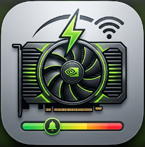
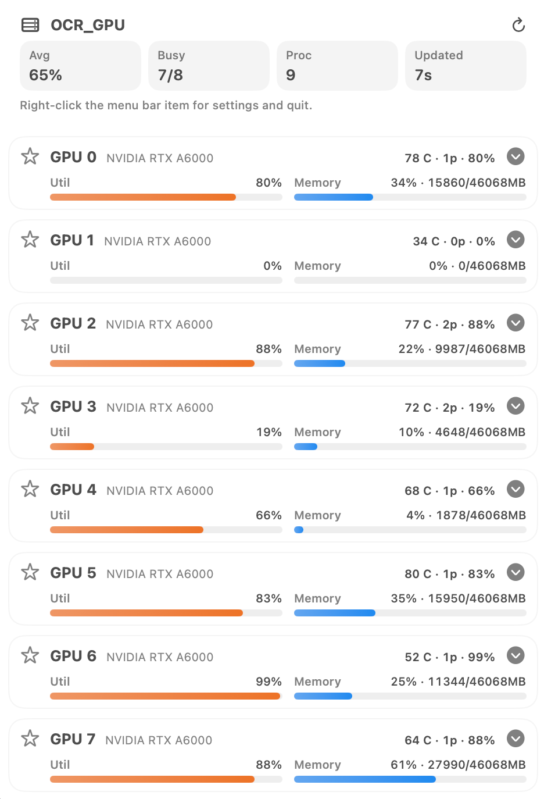

<a id="readme-top"></a>

<div align="center">
  
  <h1>GPUUsage</h1>
  <p>A native macOS menu bar app for monitoring remote NVIDIA GPU servers over SSH.</p>
  <p>
    <a href="https://github.com/jaein4722/GPUUsage/releases">Download Latest Release</a>
    ·
    <a href="https://github.com/jaein4722/GPUUsage/issues">Report Bug</a>
    ·
    <a href="https://github.com/jaein4722/GPUUsage/issues">Request Feature</a>
  </p>
</div>

## About

GPUUsage gives you a fast view of a remote GPU box without keeping a terminal open.

It connects over `ssh`, runs `nvidia-smi` on the target server, and turns the result into a compact menu bar summary plus a detailed popover UI. It is built for people who regularly ask:

- Is the server busy right now?
- Which GPU is being used?
- Which process is running on that GPU?
- Did my job finish?
- Has a watched GPU stayed idle long enough to reuse?

## Screenshots

<div align="center">
  
</div>

<p align="center"><em>At-a-glance menu bar summary</em></p>

<div align="center">
  
</div>

<p align="center"><em>Detailed popover with per-GPU status, process details, and notification controls</em></p>

## Features

- Native macOS menu bar UI with compact status text or icon-only mode
- Per-GPU utilization, memory, temperature, and process count
- On-demand process details with user, PID, memory, and command preview
- Process exit notifications through macOS Notification Center
- GPU idle notifications with configurable idle duration and memory threshold
- Import from local `~/.ssh/config`
- SSH key authentication and password-based authentication
- English / Korean UI with a `System` language option
- Light / dark / system appearance support
- Optional Dock icon and configurable popover outside-click behavior

## Installation

### Homebrew

```bash
brew tap jaein4722/tap
brew install --cask gpuusage
```

### GitHub Releases

Download the latest `.dmg` from the [Releases page](https://github.com/jaein4722/GPUUsage/releases).

## Requirements

- macOS 14 or later
- SSH access from your Mac to the target server
- `nvidia-smi` available on the remote host

## Quick Start

1. Launch GPUUsage.
2. Right-click the menu bar item and open `Settings…`.
3. Set `SSH Target` directly or import a saved host from `~/.ssh/config`.
4. Choose your authentication method.
5. Allow notifications if you want process exit or GPU idle alerts.
6. Left-click the menu bar item to open the GPU popover.

All settings apply automatically. There is no separate apply button.

## Notifications

GPUUsage supports two kinds of alerts:

- `Process Exit`: watch a running GPU process and get notified when it really exits
- `GPU Idle`: star a GPU and get notified when it stays idle long enough

You can manage notification permission, active watches, and recent notification history from the `Notifications` tab in Settings.

## Settings Overview

GPUUsage uses a native macOS-style settings window with these sections:

- `General`: server connection, authentication, polling
- `Notifications`: permission, test notification, active watches, history, idle thresholds
- `Appearance`: theme, language, Dock icon, menu bar summary, popover behavior
- `Advanced`: remote command override
- `About`: version, links, runtime summary, and current configuration

## Language Support

The interface can be set to:

- `System`
- `English`
- `Korean`

`System` follows the current macOS language. Unsupported system languages fall back to English.

## Notes

- GPUUsage uses your local SSH setup directly, including `~/.ssh/config`.
- In key-based mode, background polling does not read from Keychain.
- In password-based mode, the password is stored in macOS Keychain, not `UserDefaults`.
- If the remote non-interactive shell has a limited `PATH`, set `Remote Command` to an absolute path such as `/usr/bin/nvidia-smi`.
- Short release notes are tracked in [CHANGELOG.md](/Users/leejaein/Documents/SideProjects/GPUUsage/CHANGELOG.md).

## For Developers

Development, packaging, test app, and release workflow notes live in [docs/DEVELOPMENT.md](/Users/leejaein/Documents/SideProjects/GPUUsage/docs/DEVELOPMENT.md).

## Acknowledgments

- [Best README Template](https://github.com/othneildrew/Best-README-Template) for the structural inspiration

<p align="right">(<a href="#readme-top">back to top</a>)</p>
